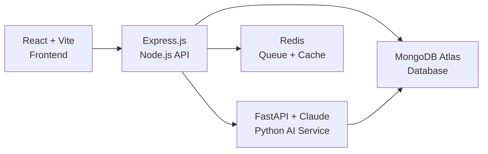

# RELIX MVP — Implementation Plan

## Goal
Build the complete RELIX (Relief Intelligence Exchange) MVP — a full-stack web platform for disaster response coordination with OCR-powered data ingestion, AI-driven prioritization, and real-time volunteer matching.

## Architecture Overview (from tech_stack_mvp_v2.md)



**Three-service architecture:**
1. `/client` — React + Vite + Tailwind + Zustand + Mapbox + Recharts
2. `/server` — Express.js + Mongoose + Bull + Socket.io + JWT
3. `/ai-service` — FastAPI + Google Vision + Tesseract + Claude API

---

## User Review Required

> [!IMPORTANT]
> **Key Decisions That Need Your Input:**
> 1. **Map Provider**: Your UI spec says Mapbox GL JS, but MVP features spec says Leaflet (free, no token). Which do you prefer? Mapbox looks better but requires an API key. **I'll default to Mapbox per your tech stack v2.**
> 2. **Python AI Service**: Your tech stack v2 adds a separate FastAPI service for AI/OCR. This means 3 services to run. Are you okay with this, or do you want OCR/LLM in the Node.js backend for simplicity?
> 3. **Database**: Are you using MongoDB Atlas (as specified), or do you want to use Firebase Firestore since you just logged in?
> 4. **API Keys**: Do you already have any of these? Google Vision, Mapbox, Claude/OpenAI, Twilio, SMTP credentials? I'll code with `.env` placeholders either way.

---

## Proposed Changes

### Phase 0: Project Scaffolding & Config

#### [NEW] Root Config Files
- `package.json` (root workspace config with npm workspaces)
- `.gitignore` (node_modules, .env, dist, uploads, __pycache__)
- `.env.example` (all environment variable templates)
- `.prettierrc` + `.eslintrc.json` (code formatting)

---

### Phase 0A: Frontend (`/client`)

#### [NEW] Vite + React Project
- Initialize with `npx create-vite@latest`
- Install: Tailwind CSS, Zustand, React Router, Recharts, Mapbox GL JS, Axios, Socket.io-client, React Hook Form, Zod, Lucide React, TanStack Query

#### [NEW] Design System (`/client/src/index.css`)
- All CSS custom properties from UI spec (colors, shadows, typography)
- Global styles, animations, skeleton loaders

#### [NEW] Folder Structure
```
/client/src/
├── components/     (Button, Card, Badge, UploadBox, Sidebar, Header, Map, Charts)
├── pages/          (Landing, Dashboard, Upload, Issues, IssueDetail, Volunteers)
├── store/          (Zustand stores: issues, auth, ui)
├── api/            (Axios instance, endpoint functions)
├── hooks/          (useSocket, useKeyboard, usePolling)
├── utils/          (formatters, validators, constants)
└── App.jsx + main.jsx
```

---

### Phase 0B: Backend (`/server`)

#### [NEW] Express.js API Server
- `server.js` — App entry point with Express, Socket.io, middleware
- `/routes/` — upload, issues, volunteers, analytics, auth
- `/controllers/` — Business logic per route
- `/models/` — Mongoose schemas (Issue, Volunteer, User, Job)
- `/middleware/` — auth, errorHandler, rateLimiter, upload
- `/services/` — SVI scoring, volunteer matching, notifications, OCR queue
- `/utils/` — logger (Winston), response helpers, validators

---

### Phase 0C: AI Service (`/ai-service`)

#### [NEW] FastAPI Python Service
- `main.py` — FastAPI app with OCR + LLM endpoints
- `/services/ocr.py` — Google Vision + Tesseract fallback
- `/services/llm.py` — Claude API for text → structured JSON
- `/services/preprocess.py` — Image preprocessing (grayscale, deskew, denoise)
- `requirements.txt` — FastAPI, google-cloud-vision, pytesseract, anthropic, Pillow, uvicorn

---

### Phase 1-3: Upload + OCR + Data Structuring

#### Backend Endpoints
- `POST /api/upload` — Multer file upload → queue to AI service
- `GET /api/jobs/:id` — Job status polling
- `POST /api/issues` — Save structured issue after preview/edit
- `GET /api/issues` — List all issues (with filters, pagination)
- `GET /api/issues/:id` — Single issue detail

#### Frontend Pages
- **Upload Page** — UploadBox with drag & drop, 7 UI states, progress bar
- **Preview Page** — Editable form with confidence coding, map pin, submit

---

### Phase 4-5: SVI Scoring + Volunteer Matching

#### Backend Services
- `sviService.js` — SVI formula, cluster scoring, tier classification
- `matchingService.js` — Proximity + skill + workload scoring algorithm
- `notificationService.js` — Nodemailer email templates

#### Backend Endpoints
- `GET /api/volunteers` — List volunteers
- `POST /api/volunteers` — Register volunteer
- `PUT /api/volunteers/:id` — Update availability/location
- `POST /api/issues/:id/assign` — Assign volunteer to issue

---

### Phase 6-7: Dashboard + Pages

#### Frontend Components
- **Sidebar** — Fixed navigation with icons
- **Header** — Logo, alerts badge, user menu
- **MetricsRow** — 4 animated KPI cards with skeleton loaders
- **ProblemMap** — Mapbox with clusters, popups, filters
- **InsightsPanel** — AI-generated insights cards
- **ChartsSection** — Recharts bar + line charts
- **TaskList** — Sortable, paginated, color-coded issue table
- **Landing Page** — Hero, impact counter, "How It Works"
- **Issues Explorer** — Card grid with virtual scroll
- **Issue Detail** — Full info + NGO contact

---

### Phase 8: Security & Auth

#### Backend
- JWT auth middleware with 24hr expiry
- `POST /api/auth/register` + `POST /api/auth/login`
- Helmet, CORS, rate limiting, input validation
- Circuit breaker for external APIs (opossum)

#### Frontend
- Auth context + protected routes
- Login/Register pages
- Token storage + auto-refresh

---

## Execution Order

I will build in this order to have a working system at each step:

| Step | What | Est. Files |
|------|------|------------|
| 1 | Root config + .gitignore + .env.example | 4 |
| 2 | Frontend scaffold (Vite + Tailwind + design system + routing) | 15 |
| 3 | Backend scaffold (Express + Mongoose + middleware + models) | 18 |
| 4 | AI service scaffold (FastAPI + OCR + LLM) | 8 |
| 5 | Auth system (backend + frontend) | 8 |
| 6 | Upload feature (backend endpoint + frontend UI) | 6 |
| 7 | OCR + Data structuring (AI pipeline) | 5 |
| 8 | SVI scoring engine | 2 |
| 9 | Volunteer matching | 4 |
| 10 | Dashboard (metrics, map, charts, insights, task list) | 12 |
| 11 | Remaining pages (landing, issues explorer, detail) | 6 |
| 12 | Real-time updates (Socket.io) | 3 |
| 13 | Polish (accessibility, keyboard shortcuts, responsiveness) | 4 |
| **Total** | | **~95 files** |

---

## Verification Plan

### Automated Tests
- Start frontend dev server (`npm run dev` in `/client`)
- Start backend server (`node server.js` in `/server`)
- Start AI service (`uvicorn main:app` in `/ai-service`)
- Verify all pages render without errors
- Test upload flow end-to-end

### Manual Verification
- Browser test: navigate all pages, check responsive design
- Upload test: upload an image and see it process
- Dashboard: verify charts, map, metrics render with mock data
